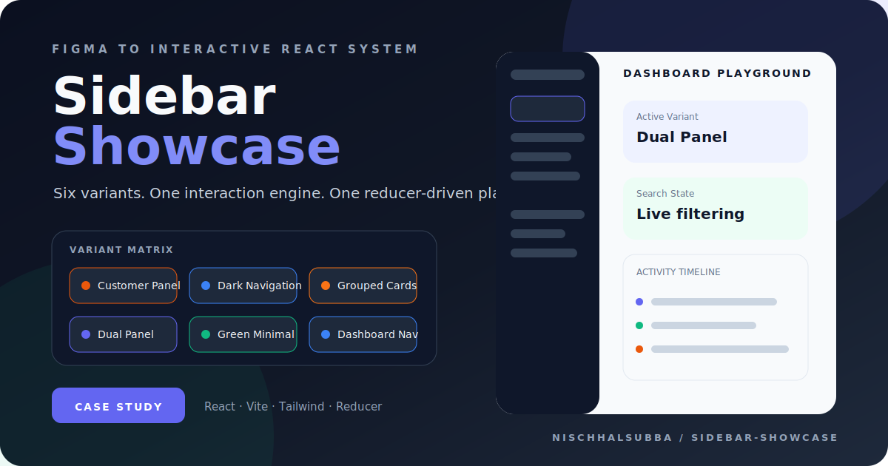

<div align="center">



# Sidebar Showcase

### Six Figma-derived sidebar systems connected through one interactive React playground

A focused design-to-code laboratory for comparing sidebar patterns, testing navigation behavior, and turning generated Figma output into a reusable interface system.

[Engineering case study](./docs/PRODUCT_AND_ENGINEERING_CASE_STUDY.md) · [Repository instructions](./AGENTS.md)


</div>

## Product concept

Sidebar Showcase is not a generic component dump. It is an interactive comparison environment for six sidebar directions imported from Figma and normalized through one shared state and interaction layer.

The workspace lets a reviewer:

- compare six visual variants
- activate one variant at a time
- switch between a gallery and dashboard playground
- search within each variant
- collapse and expand detected groups
- select items and synchronize active states
- toggle theme state
- inspect contextual actions
- review a bounded activity timeline

## Sidebar variants

| ID | Variant | Accent | Original width |
|---:|---|---|---:|
| 1 | Customer Panel | Orange | 284px |
| 2 | Dark Navigation | Blue | 277px |
| 3 | Grouped Cards | Orange | 277px |
| 4 | Dual Panel | Indigo | 476px |
| 5 | Green Minimal | Emerald | 277px |
| 6 | Dashboard Nav | Blue | 277px |

## Architecture

```text
src/
├── app/
│   ├── App.tsx
│   ├── components/
│   │   ├── interactive-sidebar.tsx
│   │   ├── sidebar-all-variants.tsx
│   │   ├── sidebar-dashboard-playground.tsx
│   │   └── sidebar-dashboard-panel.tsx
│   └── sidebar/
│       ├── action-map.ts
│       ├── reducer.ts
│       ├── types.ts
│       └── variants.ts
├── imports/            Figma-generated sidebar implementations
├── styles/             theme, Tailwind, fonts, and interaction CSS
└── main.tsx             React entry point
```

`App.tsx` owns the workspace view and reducer. `variants.ts` registers the six imported implementations. `InteractiveSidebar` adapts generated `data-name` nodes into reusable actions, search, tooltips, collapse behavior, active selection, and theme state.

## State model

The reducer tracks:

- active workspace view
- active sidebar variant
- selected item and target
- selected action type
- expanded and collapsed sections
- per-variant search queries
- light or dark theme state
- a maximum of 50 recent interaction events

This keeps generated components visually intact while moving product behavior into a predictable shared layer.

## Interaction adapter

The interaction wrapper adds behavior that raw Figma exports do not provide consistently:

- target detection through `data-name`
- action mapping
- labels derived from visible text or nearby headers
- search overlays positioned over imported search fields
- per-variant filtering
- collapse synchronization
- active-item styling
- hover tooltips for icon-only controls
- theme state forwarding
- activity logging

## Current status

| Area | Status |
|---|---|
| Six sidebar variants | Implemented |
| Variant comparison grid | Implemented |
| Dashboard playground | Implemented |
| Reducer-driven state | Implemented |
| Per-variant search | Implemented |
| Collapsible sections | Implemented |
| Theme toggling | Implemented |
| Contextual dashboard actions | Implemented |
| Activity timeline | Implemented |
| Automated tests | Not confirmed |
| Public live deployment | Not documented |
| Browser screenshot in this pass | Not captured |

The repository thumbnail is a branded presentation asset derived from the real workspace and variant system. It is not presented as a browser screenshot.

## Technology

The repository includes React, Vite, Tailwind CSS, Radix UI, Material UI, Motion, Recharts, React DnD, React Resizable Panels, `cmdk`, Sonner, Vaul, and related component utilities.

The actual app currently uses a smaller focused subset than the full dependency list suggests. Dependency pruning should be based on verified imports, not optimism with a delete key.

## Run locally

Requirements:

- Node.js 22 or newer
- pnpm 9 or newer

```bash
pnpm install
pnpm dev
```

Production verification:

```bash
pnpm check
pnpm preview
```

## Important risks

- Imported Figma components use generated names that are difficult to maintain.
- Behavior depends on `data-name` attributes remaining stable.
- The interaction adapter uses DOM inspection and mutation to bridge generated markup.
- Accessibility of imported visual components is not automatically guaranteed.
- The dependency list is much larger than the proven runtime surface.
- Search and collapse behavior should be tested after any Figma re-export.
- The repository has no documented public deployment in the inspected files.

## Recommended next work

1. Add unit coverage for reducer and action mapping.
2. Add browser tests for search, collapse, selection, and theme state.
3. Create a stable semantic contract for imported variants.
4. Replace generated file names gradually with meaningful names.
5. Audit and remove unused dependencies.
6. Test keyboard and screen-reader behavior.
7. Publish a verified deployment and capture real desktop and mobile screenshots.

## Documentation

- [Product and engineering case study](./docs/PRODUCT_AND_ENGINEERING_CASE_STUDY.md)
- [Repository instructions](./AGENTS.md)
- [Branded repository thumbnail](./docs/assets/sidebar-showcase-thumbnail.svg)

## Author

Designed and maintained by [Nischhal Raj Subba](https://github.com/Nischhalsubba).
